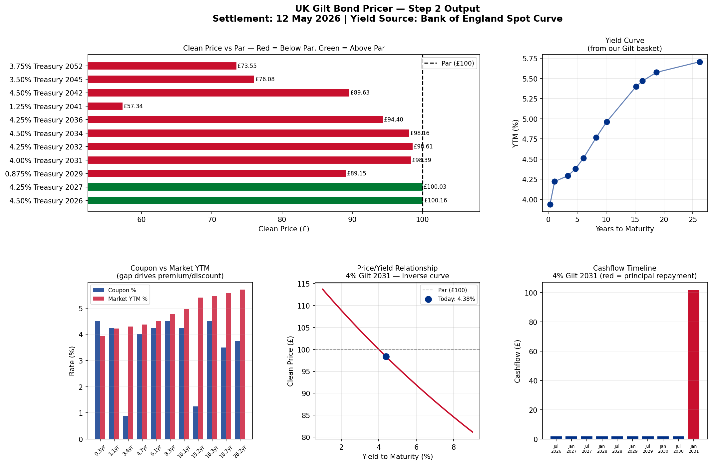
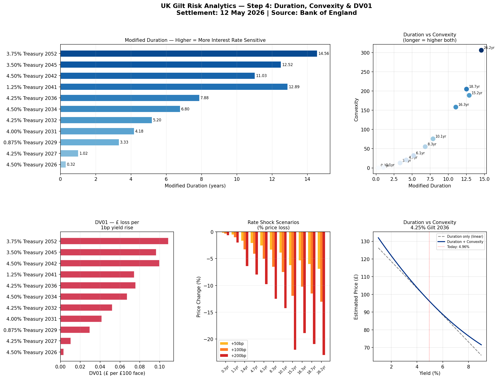
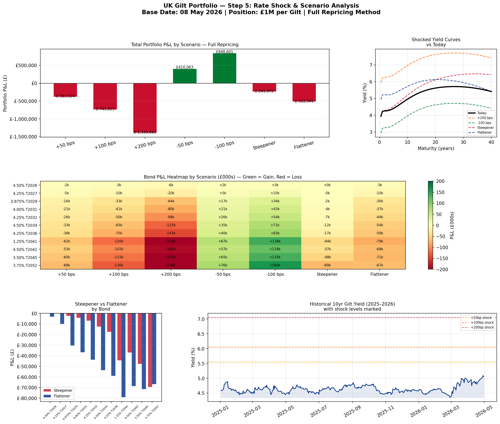

# UK Gilt Fixed Income Risk Analytics

A Python-based fixed income analytics toolkit built using **live Bank of England spot curve data**, pricing real UK Gilts and stress testing a £11M portfolio against multiple interest rate scenarios.

Built as a personal project to demonstrate practical fixed income skills aligned with CFA Level I curriculum and real-world buy-side/sell-side workflows.

---

## What This Project Does

| Module | What It Builds |
|---|---|
| `bond_pricer.py` | Prices 11 UK Gilts using full spot curve discounting |
| `step4_duration_convexity_dv01.py` | Calculates Modified Duration, Convexity & DV01 |
| `step5_rate_shock_scenarios.py` | Stress tests portfolio against 7 rate scenarios |

---

## Key Features

- **Full spot curve pricing** — each cashflow discounted at its own maturity-matched rate from the BoE curve, not a single flat yield
- **Real UK Gilt basket** — 11 actual gilts from 4.50% Treasury 2026 to 3.75% Treasury 2052
- **Live data** — Bank of England nominal spot curve, updated daily, no Bloomberg required
- **Modified Duration, Convexity & DV01** — calculated from first principles for every gilt and aggregated to portfolio level
- **Full repricing** — rate shock scenarios use exact repricing, not duration approximation
- **Non-parallel shifts** — steepener and flattener scenarios modelled alongside parallel shifts
- **347 days of historical data** — Jan 2025 to present, used for historical yield context

---

## Rate Shock Results — £11M Portfolio

| Scenario | Portfolio P&L | % Change |
|---|---|---|
| +50 bps | -£303,921 | -2.76% |
| +100 bps | -£743,823 | -6.76% |
| +200 bps | -£1,395,043 | -12.68% |
| -50 bps | +£410,063 | +3.73% |
| -100 bps | +£848,601 | +7.71% |
| Steepener (+100bp long end) | -£241,072 | -2.19% |
| Flattener (+100bp short end) | -£522,341 | -4.75% |

---

## Portfolio Risk Metrics (as of 12 May 2026)

| Metric | Value |
|---|---|
| Total Portfolio Value | £11,000,000 |
| Portfolio Modified Duration | 7.25 years |
| Portfolio Convexity | 96.05 |
| Total Portfolio DV01 | £7,976 per basis point |

**Plain English:** Every 1bp yield move across the curve = £7,976 gain or loss. A 1% rate rise = ~£797,600 portfolio loss.

---

## Charts Produced

**Step 2 — Bond Pricer**


**Step 4 — Duration, Convexity & DV01**


**Step 5 — Rate Shock Scenarios**


---

## Data Sources

| File | Source | Coverage |
|---|---|---|
| `GLC Nominal daily data current month.xlsx` | Bank of England | May 2026 (daily) |
| `GLC Nominal daily data_2025 to present.xlsx` | Bank of England | Jan 2025 → Apr 2026 |

Data downloaded free from [bankofengland.co.uk/statistics/yield-curves](https://www.bankofengland.co.uk/statistics/yield-curves) — no Bloomberg or paid data terminal required.

---

## Fixed Income Concepts Demonstrated

- **Spot rate curve** vs single yield discounting
- **Present value** of future cashflows
- **Clean price** vs dirty price vs accrued interest
- **Yield to Maturity (YTM)** — numerical solving via Brent's method
- **Macaulay Duration** — weighted average time to cashflows
- **Modified Duration** — % price sensitivity per 1% yield move
- **Convexity** — curvature correction to duration approximation
- **DV01/BPV** — £ price change per 1 basis point
- **Parallel shift** scenarios — uniform curve movement
- **Steepener** — long end rises, short end anchored
- **Flattener** — short end rises, long end anchored
- **Full repricing** vs duration approximation — and why they differ at large shocks

---

## Technical Stack

```
Python 3.13
pandas       — data loading and manipulation
numpy        — numerical calculations
matplotlib   — all visualisations
scipy        — Brent's method for YTM solving
openpyxl     — reading Bank of England Excel files
```

---

## How to Run

```bash
# Clone the repository
git clone https://github.com/mrigangsh/uk-gilt-fixed-income.git
cd uk-gilt-fixed-income

# Install dependencies
pip install pandas numpy matplotlib scipy openpyxl

# Run bond pricer
python bond_pricer.py

# Run duration & convexity analytics
python step4_duration_convexity_dv01.py

# Run rate shock scenarios
python step5_rate_shock_scenarios.py
```

---

## Author

**Mrigang Sharma**
MBA — Anglia Ruskin University, Cambridge
CFA Level I Candidate (Aug 2026)
[LinkedIn](https://www.linkedin.com/in/mrigangsharma) | London, UK

---

## Relevance to Fixed Income Roles

This project demonstrates practical application of:
- CFA Level I fixed income curriculum (bond pricing, duration, convexity)
- Risk metrics used daily by fixed income portfolio managers and traders
- Stress testing methodology used by risk teams and regulators
- Independent data sourcing without proprietary terminals
